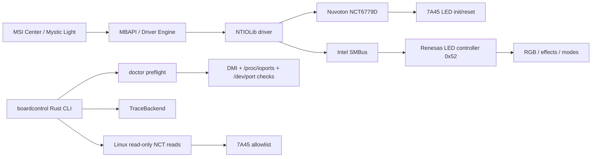

# boardcontrol


**Quick links:** [Documentation](#documentation) · [Project Map](#project-map) · [Safety Model](#safety-model) · [Roadmap](#roadmap)

Open-source experimental alternative to MSI Center / Mystic Light for low-level LED initialization control on the MSI motherboard family `7A45`.

The current codebase is a safety-first research MVP. It models known register-level behavior but does not perform real hardware writes yet.

## Documentation

- [Knowledge Map](docs/KNOWLEDGE_MAP.md) - architecture, hardware paths, register map, and safety model.
- [Safety Model](docs/SAFETY.md) - safety rules, preflight gates, and write policy.
- [Controlled Write Design](docs/CONTROLLED_WRITE_DESIGN.md) - planned gated design for future NCT hardware writes.

## Project Map



`boardcontrol` currently implements the safe/read-only side of this map: trace simulation, DMI preflight, chip detection, and allowlisted NCT register reads. LED write/apply commands are not implemented yet.

The plan commands calculate RMW reports without writing to hardware or mutating the trace backend.

## Project Status

Current MVP status:

- Rust CLI
- trace backend for safe sequence simulation
- experimental Linux read-only Super I/O chip detection
- no real LED hardware writes yet
- supports only MSI board profile `7A45`
- models the Nuvoton NCT6779D LED init/reset sequence
- includes safe RMW allowlist logic
- passes `cargo check`, `cargo test`, and `cargo clippy -- -D warnings`

## Supported Hardware Status

| Board | Super I/O | Renesas SMBus | Status |
| --- | --- | --- | --- |
| `7A45` | `Nuvoton NCT6779D` | `0x52` | `Trace simulation + experimental Linux read-only chip detection` |

## Architecture

MSI 7A45 LED control paths:

- NCT6779D Super I/O through ports `0x4E / 0x4F`
- Renesas LED controller through Intel SMBus address `0x52`

MVP structure:

- `TraceBackend`
- board profile
- NCT allowlist
- RMW executor
- CLI commands

## Safety Model

- no blind writes
- all NCT writes are modeled as read-modify-write
- every changed bit must be allowed by `(LDN, REG, allowed_change_mask)`
- unknown boards are unsupported
- real hardware writes are intentionally not implemented yet

```text
new_value = (current & and_mask) | or_mask
changed = current ^ new_value

if changed & !allowed_change_mask != 0:
    block
else:
    write
```

## Current CLI

```bash
cargo run -- detect --board 7A45
cargo run -- nct init-7a45 --dry-run
cargo run -- nct reset-led --dry-run
cargo run -- nct plan-init-7a45
cargo run -- nct plan-reset-led
```

`--dry-run` commands print a planning report first and then execute the same sequence against `TraceBackend`.
The plan commands only calculate RMW reports and do not mutate even the trace backend.
Safe CI smoke tests cover only trace/planning commands and do not access hardware.

## Test Commands

```bash
cargo fmt
cargo check
cargo test
cargo clippy -- -D warnings
```

## Roadmap

- [x] Trace-only Rust CLI MVP
- [x] 7A45 NCT init/reset sequence model
- [x] Safe RMW allowlist tests
- [x] Linux read-only NCT6779D chip detection
- [x] Linux read-only allowlisted NCT register reads
- [x] Safe doctor/preflight diagnostics
- [x] RMW planning/report layer
- [ ] Linux `/dev/port` backend for controlled NCT RMW writes
- [x] `/proc/ioports` conflict checks
- [ ] Renesas SMBus raw write backend
- [ ] Renesas RGB/mode mapping
- [ ] Windows backend

## Experimental Read-Only Hardware Detection

```bash
cargo run -- nct detect-chip --backend dev-port --confirm-read
```

This command only performs Super I/O config-mode register reads for chip identification. It does not execute LED init/reset writes.

Linux only. Requires permission to access `/dev/port`. The command refuses to run without `--confirm-read`.
Hardware read commands are gated by Linux DMI checks and are expected to run only on hosts that look like MSI 7A45. Non-target systems, such as Dell OptiPlex machines, are rejected before opening `/dev/port`.

## Safe Diagnostics

```bash
cargo run -- doctor
```

`doctor` performs non-invasive environment checks only. It reads DMI and `/proc/ioports`, checks whether `/dev/port` exists, and explains whether hardware-read commands would be blocked. It does not open `/dev/port` and does not perform Super I/O port I/O.

## Experimental Allowlisted Register Read

```bash
cargo run -- nct read-reg --board 7A45 --backend dev-port --ldn 0x09 --reg 0xE0 --confirm-read
```

This command only reads a single allowlisted NCT6779D register for the selected board profile. It refuses unknown boards, unsupported chips, non-allowlisted registers, and runs only after explicit `--confirm-read`.

## Legal / Project Note

This project does not include MSI binaries, MSI drivers, MSI logos, or decompiled MSI source code. It is an independent clean-room implementation based on observed hardware behavior and register-level research.
