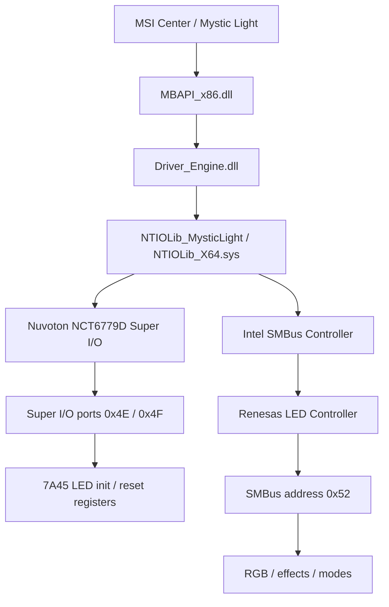

# Knowledge Map

This document summarizes the current register-level knowledge used by `boardcontrol`.
It describes the observed LED-control architecture for MSI `7A45` and how the open-source implementation maps that knowledge into safe Rust modules.

## High-Level Architecture



## boardcontrol Implementation

```mermaid
flowchart TD
    CLI[CLI] --> Doctor[doctor preflight]
    CLI --> Trace[TraceBackend]
    CLI --> LinuxRead[Linux read-only hardware commands]

    Doctor --> DMI[DMI check]
    Doctor --> IOPorts[/proc/ioports check]
    Doctor --> DevPortInfo[/dev/port existence check]

    Trace --> Seq[7A45 NCT sequences]
    Seq --> RMW[Safe RMW executor]
    RMW --> Allowlist[NCT allowlist]

    LinuxRead --> DMI
    LinuxRead --> IOPorts
    LinuxRead --> ChipID[NCT6779D chip id check]
    LinuxRead --> ReadReg[allowlisted read-reg]

    Allowlist --> ReadReg
```

## Hardware Control Paths

### NCT6779D Path

The Nuvoton NCT6779D Super I/O path uses the standard Super I/O index/data ports `0x4E / 0x4F`.
In the `7A45` family, the observed behavior is tied to LED init/reset/enable flows.
Only allowlisted LDN/register/bit positions are modeled in `boardcontrol`.

### Renesas Path

The Renesas LED controller is reached through Intel SMBus.
The controller address observed in this project is `0x52`.
This path is associated with RGB, effects, and mode behavior.
The raw protocol skeleton is known, but RGB mapping is not finalized yet.

## NCT6779D Known Register Map for 7A45

| LDN    | Register | Bit    | Meaning                                                 |
| ------ | -------- | ------ | ------------------------------------------------------- |
| `0x09` | `0xE0`   | `bit7` | LED-related control bit observed in MSI init/reset path |
| `0x09` | `0xE9`   | `bit7` | LED-related control bit observed in MSI init path       |
| `0x09` | `0x27`   | `bit4` | LED-related control bit observed in MSI init path       |
| `0x09` | `0x1B`   | `bit6` | LED-related control bit observed in MSI init path       |
| `0x09` | `0x30`   | `bit1` | LED-related control bit observed in MSI extra init path |
| `0x09` | `0x2A`   | `bit6` | LED-related control bit observed in MSI extra init path |
| `0x08` | `0xF0`   | `bit7` | LED-related control bit observed in MSI extra init path |
| `0x08` | `0xF1`   | `bit7` | LED-related control bit observed in MSI extra init path |
| `0x0B` | `0xF7`   | `bit7` | LED reset toggle bit                                    |

## Safe RMW Model

```text
new_value = (current & and_mask) | or_mask
changed = current ^ new_value

if changed & !allowed_change_mask != 0:
    block
else:
    write
```

This model avoids blind writes and only allows bit transitions explicitly covered by the allowlist.
Unknown registers are blocked.
Unknown boards are blocked.
Hardware writes are still not implemented in this stage for LED init/reset control.

## Current Implemented Safety Gates

- trace backend by default for init/reset sequences
- no apply commands
- DMI must look like MSI 7A45
- `/proc/ioports` must not report `004e-004f` busy
- chip id high byte must be `0xC5`
- read-reg only allows registers from allowlist
- Dell OptiPlex non-target refusal was tested

## Current Project State

Implemented:
- Trace-only NCT sequence simulation
- Safe RMW allowlist model
- Linux DMI preflight
- `/proc/ioports` conflict check
- read-only NCT6779D chip ID detection
- read-only allowlisted NCT register read
- doctor/preflight diagnostics
- GitHub CI

Not implemented yet:
- LED write/apply commands
- controlled NCT RMW hardware writes
- Renesas SMBus backend
- RGB/mode/brightness mapping
- Windows backend
